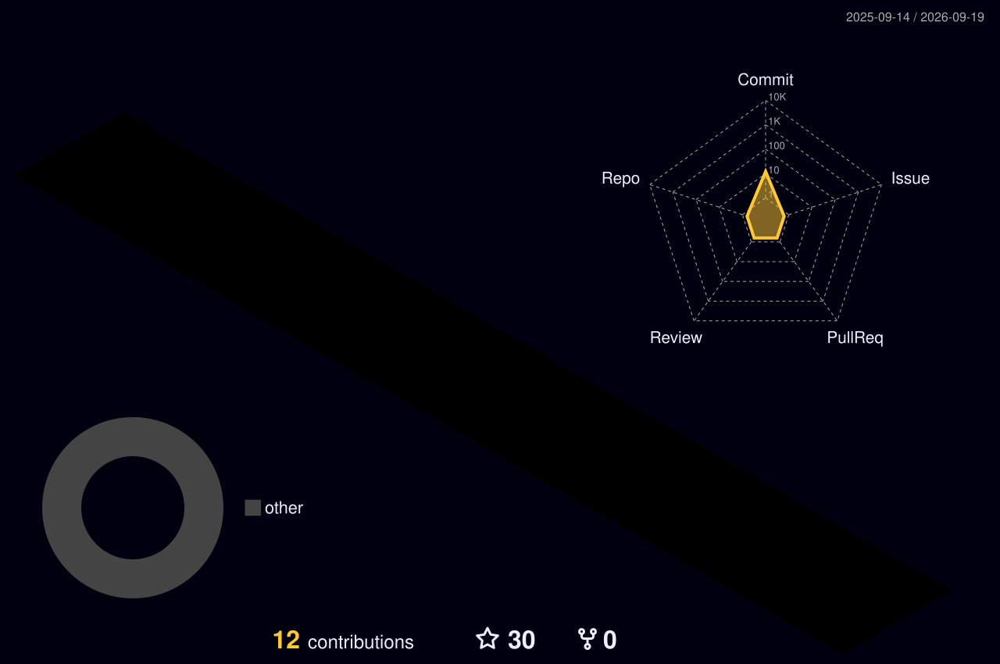

<h2 align="center">✨&nbsp;Hallo!◝(⁰▿⁰)◜ ✨&nbsp;&nbsp;&nbsp;🪐I'm Helgi Schumacher🪐</h2>

<h3 align="center">Front-end Developer • React • TypeScript • UI/UX Enthusiast</h3>

  🌱 <strong>Currently learning:</strong> React 
  💼 <strong>Looking for:</strong> Front-end opportunities 
  📫 <strong>Contact:</strong>
  <a href="https://www.linkedin.com/in/hphschumacher/">LinkedIn</a>

  

  

  

<h2></h2>

<h3 align="center">Languages, Tools & Technologies</h3>

<h4 align="center">Languages</h4>

  
  
  
  
  
  

<h4 align="center">Frameworks & Styling</h4>

  
  
  
  

<h4 align="center">Tools</h4>

  
  
  
  

<h2></h2>

  

Thanks for visiting ⭐

