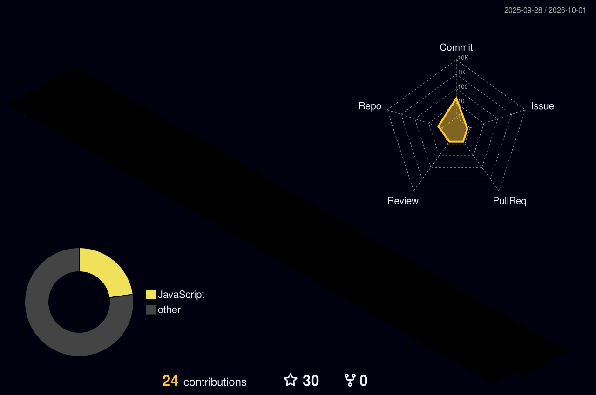

  

 

  

  

  

  

  

<h3 align="center">Languages, Tools & Technologies</h3>

<h4 align="center">Languages</h4>

  
  
  
  
  
  

<h4 align="center">Frameworks & Styling</h4>

  
  
  
  

<h4 align="center">Tools</h4>

  
  
  
  

  

  

⭐ Thanks for visiting ⭐

✝️ 1 Corinthians 13:4-7 ❤️

