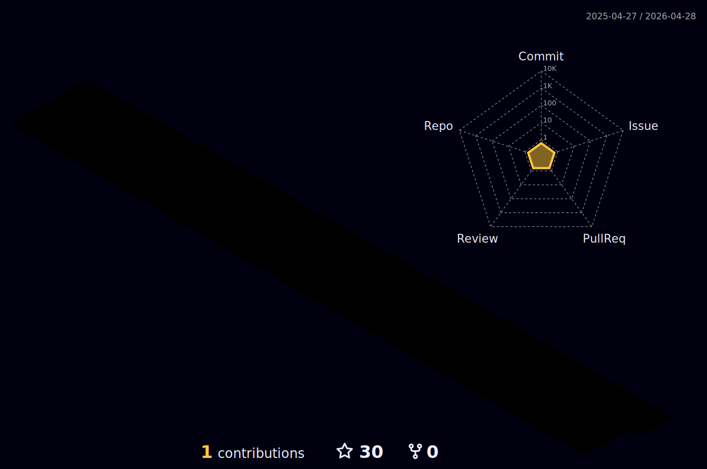

<h2 align="center">✨&nbsp;Hallo!◝(⁰▿⁰)◜ ✨&nbsp;&nbsp;&nbsp;🪐I'm Helgi Schumacher🪐</h2>

<h3 align="left">I'm a junior front-end dev, passionate for aesthetic designs and cool projects</h3>

> (ง •̀_•́)ง💻 — **Currently I'm working on:**
> 
> (ง・∀・)ﾉ📚 — **Right now I'm learning more about React**
> 
> (｡･.･)ﾉﾞ🙋🏻‍♂️ — **You can reach me here:**
> 
> 

<h2></h2>
<h3 align="center">Languages, Tools & Tecnologies</h3>

             

<h2></h2>

<h3 align="left">Total Visits</h3>

